# Blo-my
**Blo-my** Blo-my는 Blockchain Army의 약자로 블록체인을 활용한 국방 데이터 유통 프로젝트입니다.
<div align="center">
 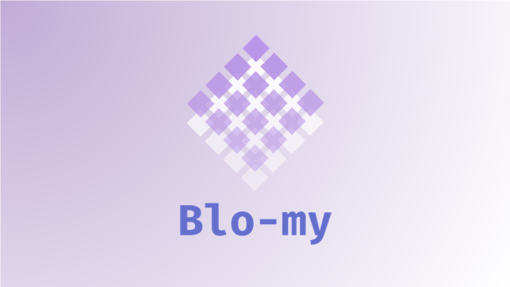
</div>

<p align="center">
	<a href="https://github.com/osamhack2021/CLOUD_WEB_Blo-my_Byzantium/search?l=JavaScript&type=code"></a>
	<a href="https://github.com/osamhack2021/CLOUD_WEB_Blo-my_Byzantium/graphs/contributors"></a>
	<a href="https://github.com/osamhack2021/CLOUD_WEB_Blo-my_Byzantium/stargazers"></a>
	<a href="https://github.com/osamhack2021/CLOUD_WEB_Blo-my_Byzantium/network/members"></a>
	<a href="https://github.com/osamhack2021/CLOUD_WEB_Blo-my_Byzantium/blob/master/LICENSE"></a>
  </p>
<p align="center">
  <a href="https://github.com/osamhack2021/CLOUD_WEB_Blo-my_Byzantium/blob/master/doc/presentation/blo-my_presentation.pdf"></a><br>
  <a href="https://donggni0712.gitbook.io/blo-my/"></a><br>
  <a href="https://www.youtube.com/"></a>
</p>

## **무결성과 책임 추적성** :closed_lock_with_key:
 블록체인의 위,변조 불가는 무결성과 책임 추적성이 중요한 분야에서 활용이 용이하다. 
 국방 분야의 군수, 방산 계약, 공문서 관리 등과 같은 분야에 블록체인을 도입한다면 데이터에 대한 신뢰도가 향상되고, 탈중앙화된 데이터 관리와 개인 키를 통한 암호화로 인해 높은 책임 추적성을 보장할 수 있다.
## **오픈소스 프로젝트** :open_file_folder:
 Blo-my는 블록체인의 이러한 특성들을 국방 데이터에 어떤식으로 활용할 수 있는 지를 보여주는 오픈 소스 프로젝트이다. 현재에는 총기수불, 부식 작전 데이터 다루는 프로젝트지만, Blo-my 데이터 유통의 원리만 활용한다면 다양한 국방데이터를 블록체인에 접목시킬 수 있다.
 또, Blo-my의 발전은 다양한 컨트리뷰터들에 의해서 이루어지므로 별도의 국방 예산 없이 발전이 이루어질 수 있다.

# :books: 목차
- [:book:**프로젝트 소개**](#book-프로젝트-소개)
  - [프로젝트 개요](#프로젝트-개요)
  - [프로젝트 요약](#프로젝트-요약)
- [:electric_plug:**컴퓨터 구성 / 필수 조건 안내**](#electric_plug-컴퓨터-구성--필수-조건-안내-prerequisites)
- [:wrench:**사용 기술**](#wrench-사용-기술-technique)
  - [기술 스택](#기술-스택-technique-used)
  - [Hyperledger-fabric](#hyperledger-fabric)
  - [데이터 생성 방식](#데이터-생성-방식)
- [:floppy_disk:**설치 & 시작 안내**](#floppy_disk-설치--시작-안내-installation-process--getting-start)
  - [Hyperledgher-fabric 서버 실행](#hyperledgher-fabric-서버-실행)
  - [Back-end 서버 실행](#back-end-서버-실행)
  - [Front-end 실행](#front-end-실행)
- [:computer:**제공 기능**](#computer-제공-기능-service)
  - [총기 수불](#총기-수불gun)
  - [부식 작전](#부식-작전rice)
  - [Hyperledgher-fabric 서버 개발자 기능](#hyperledgher-fabric-서버-개발자-기능hammer)
- [:family:**팀 정보**](#family-팀-정보-team-information)
- [:mag:**저작권 및 사용권 정보**](#mag-저작권-및-사용권-정보-copyleft--end-user-license)

# :book: 프로젝트 소개
## 프로젝트 개요  
| **문제 상황** | **해결 방안** |
|--------|--------|
| :floppy_disk:**로컬 데이터** - 인트라넷에서 유통되기 전, PC에서 local파일로 총기수불대장이 존재할 때, PC에 오류가 생기면 기존의 모든 데이터가 삭제됨 | :cloud:**클라우드** - 데이터가 생성되는 즉시 프라이빗 인트라넷에 등록하여 PC문제로 데이터가 삭제되는 상황을 예방 |
| :smiling_imp:**변조 위험** - 인트라넷이 해킹될 경우 데이터 변조가 쉬움 | :link:**블록체인** -  블록체인을 활용하여 변조 불가능한 데이터 유통 |
| :no_mobile_phones:**접근성** - 예하부대는 자신의 상급부대에서 부식이 어떤식으로 유통되고 있는 지 현 상황을 확인하기가 힘듦| :computer:**서비스** - 블록체인 네트워크를 활용하여 각 식자재에 대한 유통 과정을 확인할 수 있도록 함 |

## 프로젝트 요약
- :closed_lock_with_key:무결성
- :mag:책임 추적성
- :open_file_folder:오픈 소스 프로젝트

# :electric_plug: 컴퓨터 구성 / 필수 조건 안내 (Prerequisites)
* ECMAScript 6 지원 브라우저 사용
* 권장: Google Chrome 버젼 77 이상

# :wrench: 사용 기술 (Technique)
## 기술 스택 (Technique Used)
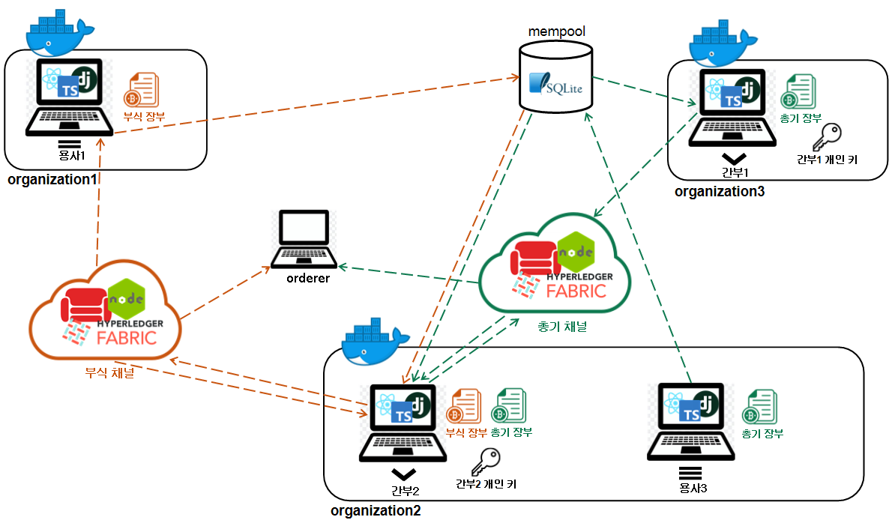

### **Infra**
|<a href = "https://www.docker.com/">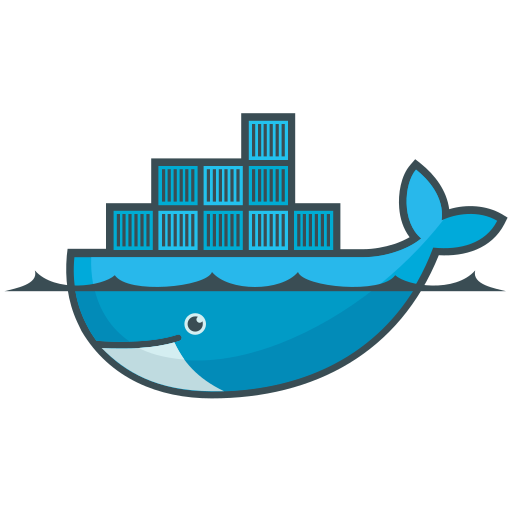</a>|
|:--:|
|Docker|

### **Server**
|<a href = "https://github.com/hyperledger/fabric">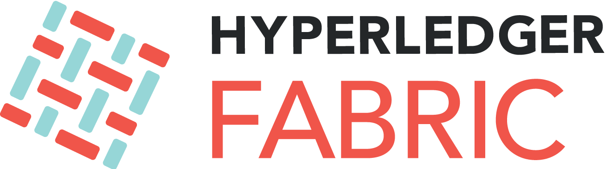</a>|<a href = "https://nodejs.org/ko/"></a>|
|:--:|:--:|
|Hyperledger-fabric|nodeJS|

### **DB**
|<a href="https://www.sqlite.org/index.html"></a>|<a href="http://couchdb.apache.org/"></a>|
|:--:|:--:|
|SQLite|CouchDB|

### **Back-end**
|<a href="https://www.djangoproject.com/"></a>|
|:--:|
|django|

### **front-end**
|<a href="https://ko.reactjs.org/"></a>|<a href="https://www.typescriptlang.org/"></a>|
|:--:|:--:|
|React|TypeScript|


## Hyperledger-fabric
- **하이퍼레저 패브릭이란**
  - **허가형 프라이빗 블록체인** - 누구나 자유롭게 참여할 수 있는 기존의 블록체인과는 다르게 자체 인증 시스템에 의해 허가된 사용자만이 블록체인 네트워크에 참여할 수 있다.
  - **별도의 원장 생성 가능** - 기존의 블록체인은 블록체인 네트워크에 참여한 모든 참여자가 모든 정보에 대한 원장을 가지고 있었다. 하지만 하이퍼레저에서는 채널을 이용해 해당 정보를 공유하고자하는 노드 간에만 별도의 원장을 생성하는 것이 가능하다.
- **왜 하이퍼레저 패브릭인가**    
  - **국방 데이터의 기밀성** - 기존의 블록체인으로는 국방 데이터의 특성인 '기밀성'을 보장할 수 없다. 하이퍼레저는 허가된 사용자만 블록체인 네트워크에 참여할 수 있기때문에 군 외부로의 정보 유출을 방지할 수 있다.
  - **국방 데이터의 보안성** - 모든 국방 데이터가 같은 보안 등급을 가진 것은 아니다. 3급 기밀, 2급 기밀 등 정보의 보안 등급에 차이가 있고, 이러한 경우 모든 장병이 같은 장부를 가지게 하는 것이 제한된다. 하이퍼레저에서 제공하는 채널을 사용해 이러한 문제를 쉽게 해결할 수 있다.  
  - **플랫폼의 완성도** - 자체적인 네트워크를 개발하면 예상치 못한 버그, 네트워크 보안성 문제 등의 문제가 발생할 수 있다. 이미 검증된 오픈소스 프로젝트인 하이퍼레저 패브릭을 사용함으로써 블록체인 네트워크 구조의 완성도를 높일 수 있다.

## 데이터 생성 방식
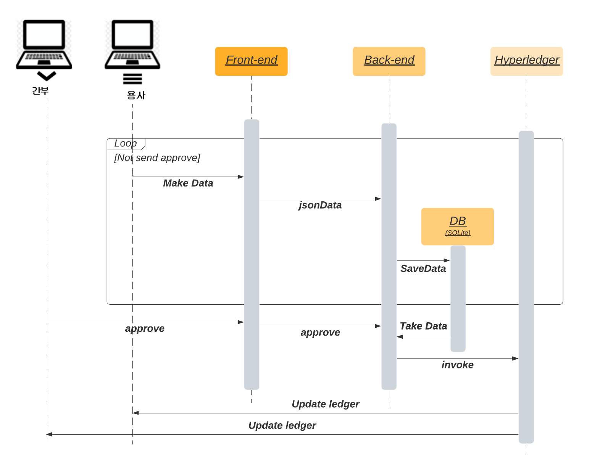

# :floppy_disk: 설치 & 시작 안내 (Installation Process & Getting Start)

### Git Clone
```bash
git clone https://github.com/osamhack2021/CLOUD_WEB_Blo-my_Byzantium.git
```

## :pushpin:요약
[Hyperledger-fabric 서버 실행](#hyperledgher-fabric-서버-실행)부터 [front-end-실행](#front-end-실행) 실행까지 명령어는 start.sh에 함축되어있다. 아래 명령어를 실행하면 별도의 명령어 없이 Blo-my를 설치/실행 할 수 있다.
```bash
./start.sh
```

## Hyperledgher-fabric 서버 실행
1. 하이퍼레져 도커 이미지 및 바이너리 설치, 새로운 환경일때마다 실행해야함.
```bash
cd "/workspaces/CLOUD_WEB_Blo-my_Byzantium/WEB(BE)/fabric-samples/blomy/javascript"
curl -sSL https://bit.ly/2ysbOFE | bash -s
```
2. nodejs dependency 설치
```bash
cd /workspaces/CLOUD_WEB_Blo-my_Byzantium/WEB(BE)/fabric-samples/blomy/javascript
npm install
cd /workspaces/CLOUD_WEB_Blo-my_Byzantium/WEB(BE)/fabric-samples/chaincode/blomy/javascript
npm install
cd /workspaces/CLOUD_WEB_Blo-my_Byzantium/WEB(BE)/fabric-samples/chaincode/blomyfood/javascript
npm install
```
3. 블록체인 네트워크 실행(총기 채널 자동 실행됨)
```bash
cd /workspaces/CLOUD_WEB_Blo-my_Byzantium/WEB(BE)/fabric-samples/blomy
. startFabric.sh javascript
```
4. 부식 채널 실행
```bash
cd /workspaces/CLOUD_WEB_Blo-my_Byzantium/WEB(BE)/fabric-samples/test-network
./networkFood.sh up createChannel -ca -s couchdb
./networkFood.sh deployCC -ccn blomyfood -ccv 1 -cci initLedger -ccl javascript -ccp ../chaincode/blomyfood/javascript
```

5. admin 생성 후 app유저 생성
```bash
cd /workspaces/CLOUD_WEB_Blo-my_Byzantium/WEB(BE)/fabric-samples/blomy/javascript
node enrollAdmin.js
node registerUser.js
```

6. 새로운 asset 생성
```bash
node invoke.js
node invokefood.js
```

7. Hyperledger-fabric rest 서버 실행
```bash
cd /workspaces/CLOUD_WEB_Blo-my_Byzantium/WEB(BE)/fabric-samples/blomy/javascript
node rest.js
```

## Back-end 서버 실행
```bash
cd /workspaces/CLOUD_WEB_Blo-my_Byzantium/WEB/backend
sudo apt-get install pkg-config
sudo apt-get install libcairo2-dev
pip install -r requirements.txt
pip3 install requests --force-reinstall
pip install lxml
python manage.py runserver
```

## Front-end 실행
```bash
cd /workspaces/CLOUD_WEB_Blo-my_Byzantium/WEB/frontend
yarn
yarn build
yarn start
```


# :computer: 제공 기능 (Service)
[▶제공 기능 자세히 보기](https://donggni0712.gitbook.io/blo-my/service_introduction/service)

| |데이터 조회|데이터 생성|최종 승인|
|--|--|--|--|
|용사|:heavy_check_mark:|:heavy_check_mark:|:x:|
|간부|:heavy_check_mark:|:heavy_check_mark:|:heavy_check_mark:|

 Blo-my에서는 용사와 간부로 유저 계층을 나누어 서비스를 제공한다. 계층별로 제공되는 서비스는 위와 같다.


## 총기 수불:gun:
|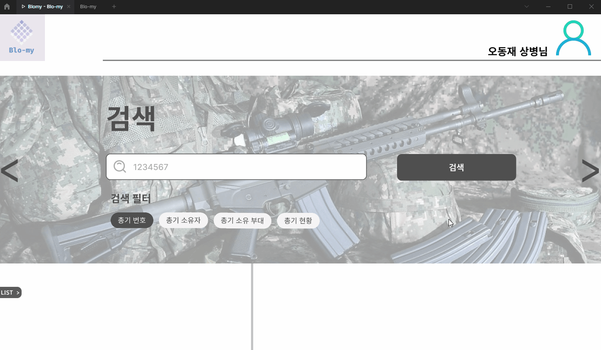|||
|--|--|--|
|▲총기 검색 페이지|▲총기 업데이트|▲총기 목록 조회|


## 부식 작전:rice:
|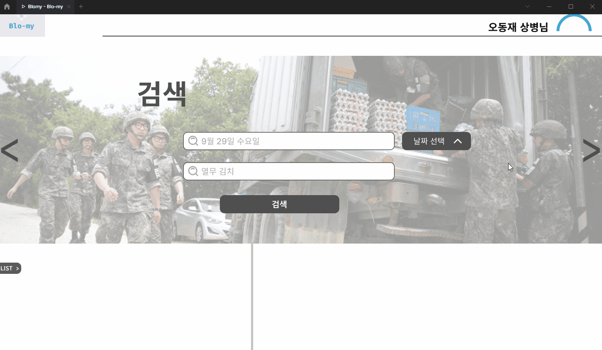|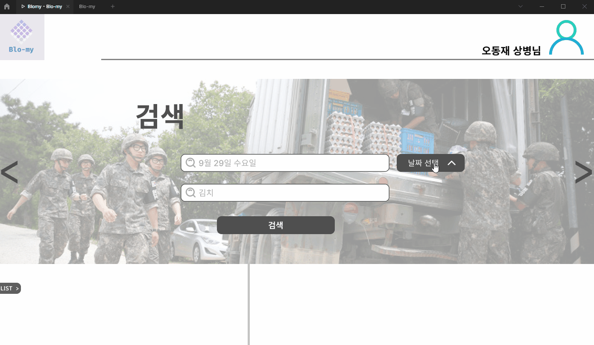||
|--|--|--|
|▲부식 작전 페이지|▲부식 작전 내역 검색|▲부식 작전 목록 조회|
 
## 데이터 승인:black_nib:
|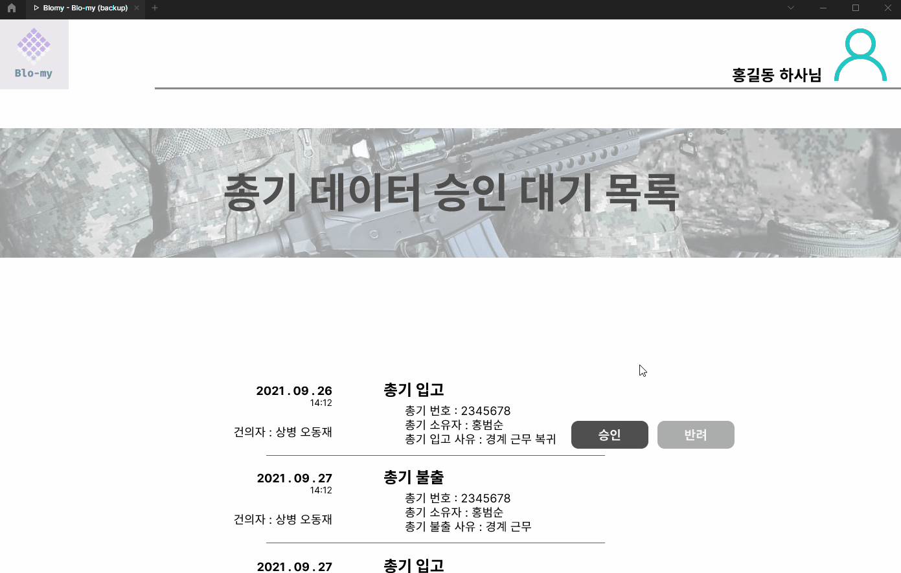|
|--|
|▲간부 권한의 데이터 승인 페이지|

## Hyperledgher-fabric 서버 개발자 기능:hammer:
[▶개발자 기능 사용법 자세히 보기](https://github.com/osamhack2021/CLOUD_WEB_Blo-my_Byzantium/tree/master/fabric-samples#%EB%84%A4%ED%8A%B8%EC%9B%8C%ED%81%AC%EB%AA%A8%EB%8B%88%ED%84%B0-%ED%88%B4%EB%94%94%EB%B2%84%EA%B9%85)
||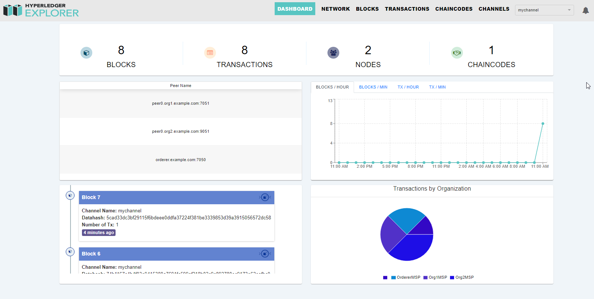|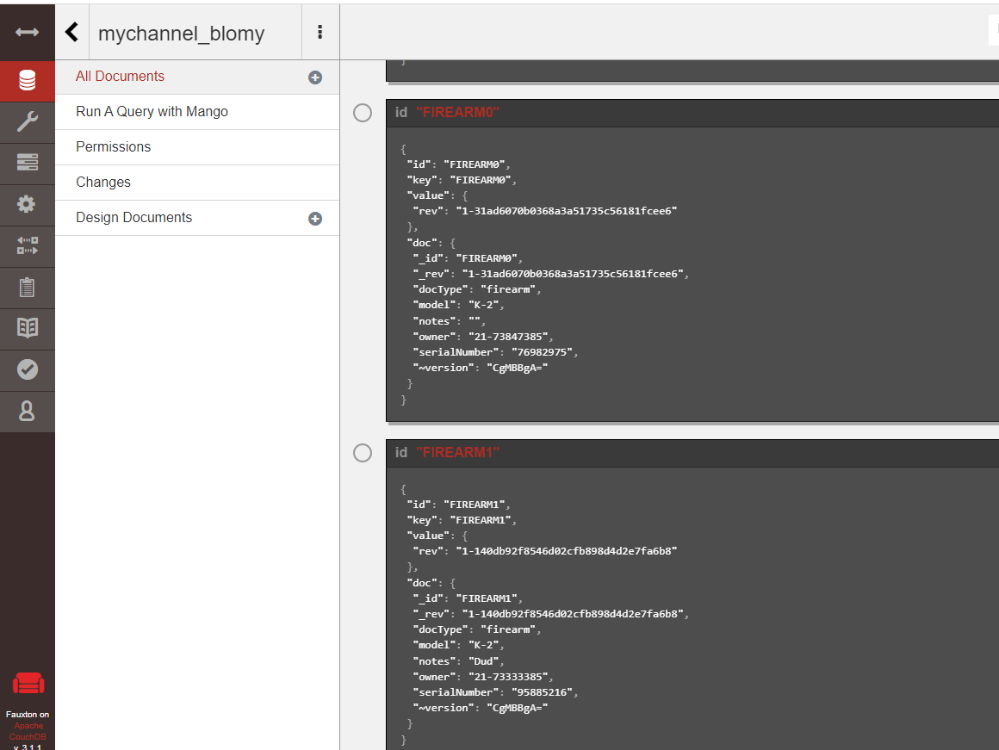|
|--|--|--|
|▲네트워크 모니터링|▲Hyperledger explorer|▲CouchDB 데이터 확인|


# :family: 팀 정보 (Team Information)
<h6 align="center">(팀원 정렬 순서는 이름순입니다.)</h6>

|name|role|GitHub|Division|Rank|
|--|--|--|--|--|
|박한성|Hyperledger-fabric|<a href="https://github.com/hspark15429"></a>|육군|**一²** 일병|
|송문경|Front-end|<a href="https://github.com/moonsong98"></a>|육군|**一³** 상병|
|오동재|leader|<a href="https://github.com/donggni0712"></a>|육군|**一³** 상병|
|정현구|Hyperledger-fabric|<a href="https://github.com/kojjok97"></a>|육군|**一⁴** 병장|
|홍범순|Back-end|<a href="https://github.com/beomsun0829"></a>|육군|**一³** 상병|


# :mag: 저작권 및 사용권 정보 (Copyleft / End User License)
## License
- Apache-2.0(IBM corp all rights reserved)
## 이모티콘 출처
- https://www.flaticon.com/
## 참조
- https://github.com/hyperledger/fabric-samples
- https://github.com/hyperledger/blockchain-explorer
